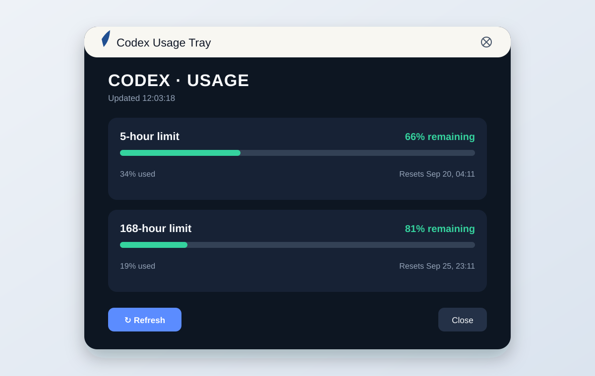
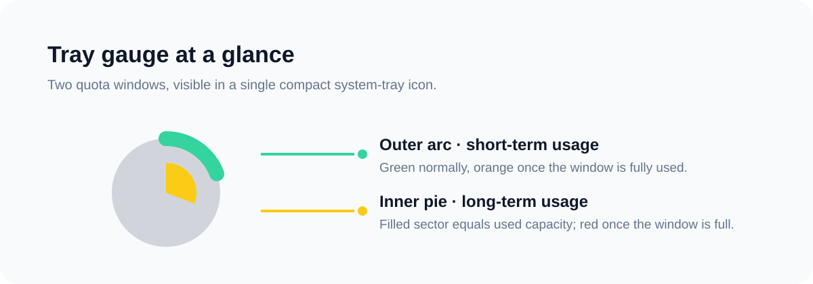
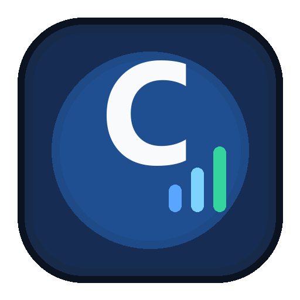

# Codex Usage Tray

A Windows system-tray companion for viewing local Codex usage with clear progress bars.





### Desktop shortcut icon



## Download

Download the ready-to-run Windows package: [codex-usage-tray-windows.zip](dist/codex-usage-tray-windows.zip).

## Features

- Open the usage panel from the tray icon.
- A compact tray gauge visualizes the first two active usage windows. The outer ring is the short-term window (green, orange when full); the inner pie is the long-term window (yellow, red when full), with its filled sector directly representing used capacity. Hovering it shows a concise two-line summary.
- View every available usage window with green / red progress bars.
- Refresh on demand or on a configurable interval (15 minutes by default).
- Receive a one-time alert when remaining capacity drops below a threshold.
- Reads only from the locally authenticated Codex CLI app-server: no browser cookies or credentials are stored, and it does not depend on the Desktop app daemon.
- High-DPI dark interface and a consistent app icon for the window, tray, and shortcuts.

## Run

```powershell
pip install -r requirements.txt
python app.py
```

You can also double-click `run.bat`. The panel opens immediately and no console window remains.

### Create shortcuts

From PowerShell in the project directory:

```powershell
.\install.ps1
```

This creates Desktop and Start menu shortcuts, and starts the app minimized to the tray at sign-in. To skip start-at-sign-in:

```powershell
.\install.ps1 -NoStartup
```

On first run, `%APPDATA%\CodexUsageTray\settings.json` is created. After editing it, select **Reload settings** from the tray menu. If the application cannot start, check `codex-usage-tray.log` in the same folder.

## Settings

- `refresh_minutes`: automatic refresh interval in minutes; set to `0` to disable it.
- `remaining_alert_percent`: alert when any window has this percentage or less remaining.

## Requirements

- Windows 10/11
- Python 3.10+
- Codex CLI installed and signed in (`codex login`)

This tool relies on the Codex CLI local app-server, which is experimental. If its protocol changes, the app shows the actual read error rather than misreporting the result as 0% usage.
